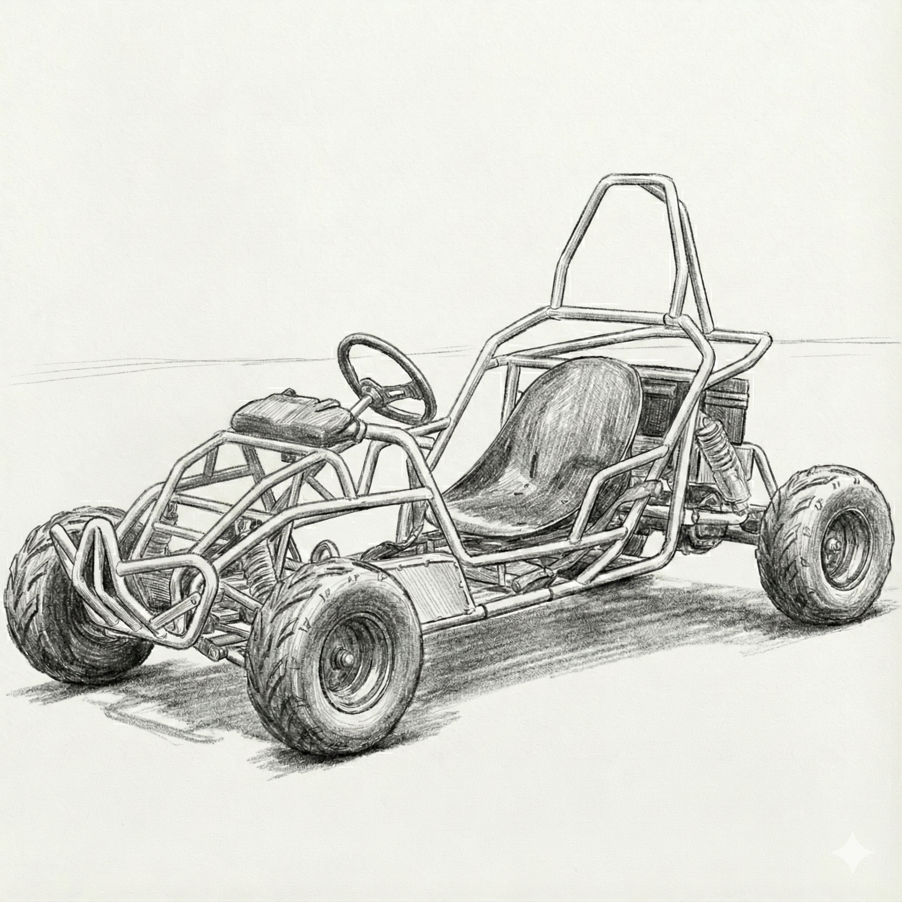
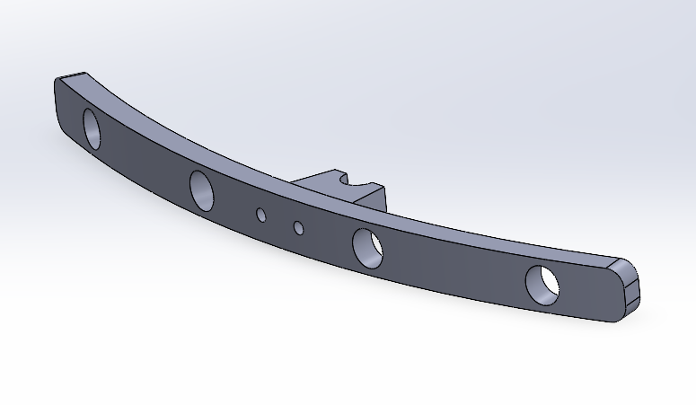
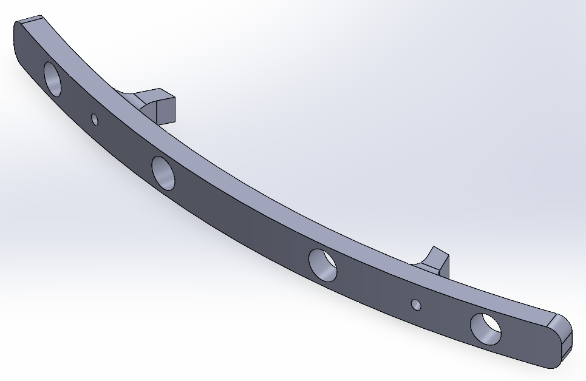
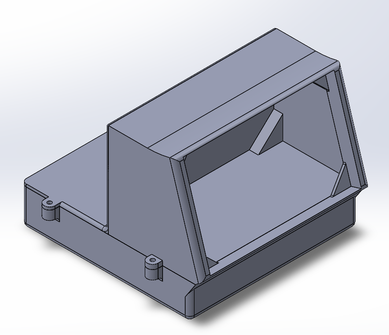
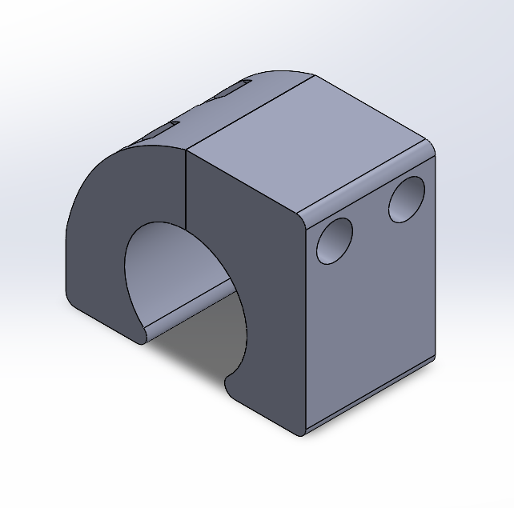
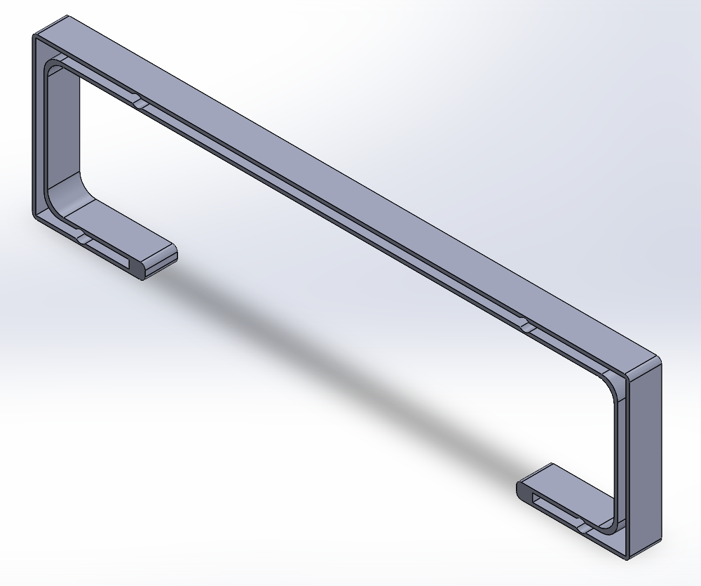
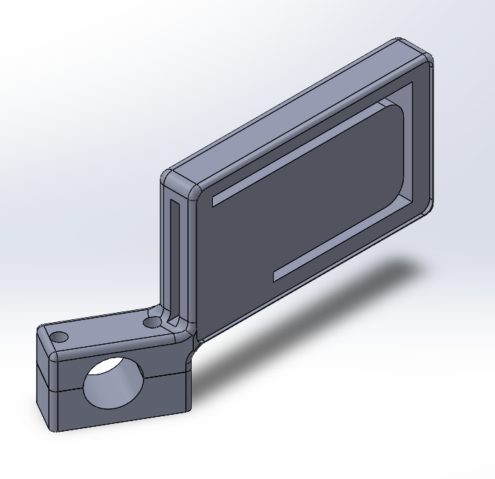

# Mechanical Design & Prototyping

This directory contains all mechanical assets for the EV project, including 3D printable STL files, 2D laser-cutting profiles for the acrylic body, and archived resources for student activities.



## 📂 Directory Structure

```
mechanical/
├── 3D_Printed_Parts/          # Custom parts for sensors, control units, and mounts
├── Acrylic_Covers/            # 2D profiles for body panels (laser cut)
├── Steering_Prototype.zip     # Archived prototype files for student steering activity
└── README.md                  # This documentation file

```

## 1. [3D Printed Parts](mechanical/3D_Printed_Parts/)
*Material Recommendation: PLA*


| Component                 | Preview                                             | Function / Description                                                                                   | ⚠️ Design Defects & V2 Improvements                                                                                                                                                                                                                 |
| ------------------------- | --------------------------------------------------- | -------------------------------------------------------------------------------------------------------- | ----------------------------------------------------------------------------------------------------------------------------------------------------------------------------------------------------------------------------------------------------- |
| **Front Bar**       |  | Mounts the waterproof ultrasonic sensors to the front chassis.                                           | **Tolerance Issue:** Sensor holes are too tight.   →*Fix:* Increase hole diameter for proper fit.                                                                                                                                            |
| **Back Bar**        |  | Mounts rear ultrasonic sensors. Interfaces with the*Holder*piece.                                      | **Alignment Issue:** Screw holes are tilted, causing misalignment with the holder. Sensor holes are also too tight.   →*Fix:* Straighten screw channels and increase sensor hole size.                                                       |
| **Control Box**     |  | 3-part main control unit housing. Holds the Touch Screen, Raspberry Pi, Sensors, and Relays.             | **Volume & Fitment Issues:** 1. Bottom face is closed, restricting inner space.*Fix: Open the ground face.* 2. Screen mounting is improper, causing bending when screws are tightened.*Fix: Add dedicated screen mounting holes/standoffs.* |
| **Chassis Holder**  |  | 2-piece clamp mechanism that locks onto the tubular chassis. Anchors the acrylic sheets and sensor bars. | **Fitment Issue:** Inner diameter is too large to grip the tube securely.   →*Fix:* Reduce inner diameter to ensure a tight friction fit when screwed down.                                                                                  |
| **Back LED**        |  | Grooved bar mounted on the*Back Cover* . Holds the neon LED strip.                                     | ✅**Ready:** No reported issues.                                                                                                                                                                                                                |
| **Front LED (L/R)** |  | "Side Mirror" style housings (Left & Right) with grooves for neon LED strips.                            | **Angle Issue:** The mount angle causes lights to point incorrectly.   →*Fix:*Adjust mounting angle to face straight forward.                                                                                                                  |

## 2. [Acrylic Body Covers](/Smart_EV_Kit/mechanical/Acrylic_Covers/)

*Material Recommendation: 3mm or 4mm Acrylic / Polycarbonate.*

| Assembly Group               | Function / Description                                                                                                          | ⚠️ Design Defects & V2 Improvements                                                                                                   |
| ---------------------------- | ------------------------------------------------------------------------------------------------------------------------------- | --------------------------------------------------------------------------------------------------------------------------------------- |
| **Back Cover (Lower)** | 3-part assembly covering the motor/battery area. Includes cutouts for the**Circuit Breaker**and **Charging Port** . | ✅**Ready:** Accessibility features work well (charging possible without removal).                                                |
| **Back Cover (Upper)** | 5-part assembly for the upper-rear roll cage. The middle section supports the*Back LED*bar.                                   | ✅**Ready:** Fits correctly.                                                                                                      |
| **Front Cover**        | 3-part assembly intended for the nose/hood.                                                                                     | ❌**Failed:** Multiple chassis angles made fitment impossible.   →*Action:* Reverted to original stock cover (repainted).      |
| **Side Cover**         | 3-part assembly protecting the vehicle sides.                                                                                   | **Fitment Issue:** Missing cutout for the driver's seatbelt anchor.   →*Fix:* Add relief cut to accommodate the seatbelt bolt. |

## 3. Student Activity Resources

### 📦 [Steering_Prototype](/Smart_EV_Kit/mechanical/rack-and-pinion-steering-model_Activity.zip)


**Description:** A compressed archive containing prototype files and assets for the student steering mechanism activity.

**Contents:**

* CAD Files for steering linkage prototype.
* Reference documentation for student assembly.

*Last Updated: January 2026*

## [Back To Main]()
